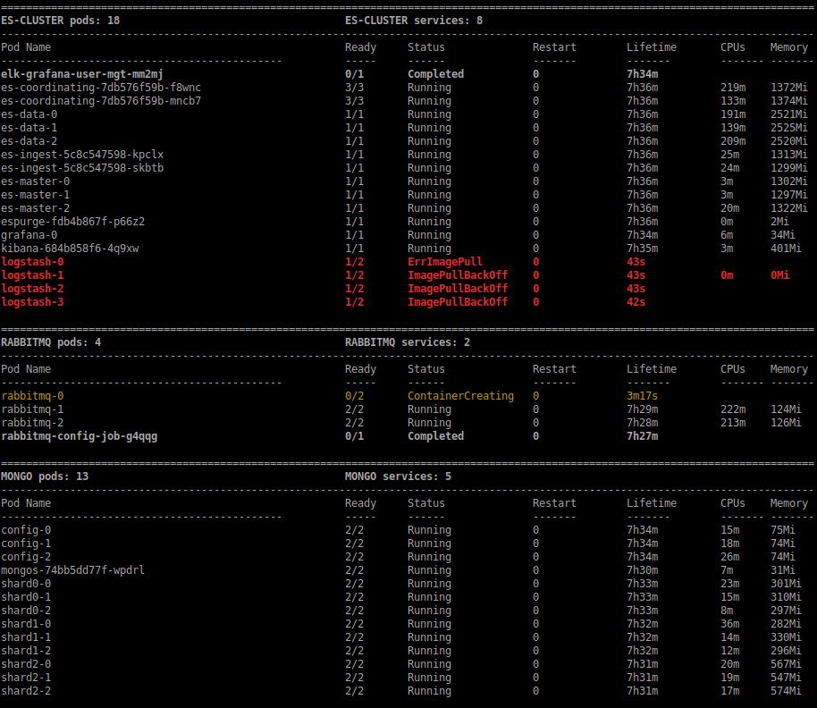

<!-- TOC depthFrom:1 depthTo:6 withLinks:1 updateOnSave:1 orderedList:0 -->

- [monitor_workload](#monitorworkload)
- [Description](#description)
- [Requirements](#requirements)
- [Usage](#usage)
	- [Help](#help)
- [TODO](#todo)

<!-- /TOC -->


# monitor_workload

# Description

This script display the used/deployed resources of a Kubernetes cluster.

* At Node Level : CPU/Mem by node and total average
```
monitor_workload.sh -n
```


* At Pod level : Pods list by namespace highlighting status
```
monitor_workload.sh -p
```


# Requirements

* The user must be authenticated on the Kubernetes cluster.
* The user must have node and pod describe privileges
* Kubectl >= 1.11 is requierd
  previous kubectl version are supported in older versions of this script

# Usage

Without any option the script will watch nodes and pods resources

Edit the script to configure the selected namespaces in `MONITORED_NS` array for `-w` option.
```
ex: MONITORED_NS=(kube-system rabbitmq es-cluster)
```

## Help

```
Usage: monitor_workload.sh [options...]

Running the script with no options will watch
for nodes and pod resources on all available namespaces.

  -w    Filter Pods from configurated namespaces only
  -n    Display Nodes used resources informations and exit
  -p    Watch only Pods deployed resources informations
  -h    Display this help

  To define pods namespaces filtering with "-w",
  edit the MONITORED_NS array in script.
```
---


# TODO

* Namespace include list as argument
* Calculate node resources left (more parsing required)
* See `kubect top` integration for pod resources consumption (need cadvisor metrics enabled)
